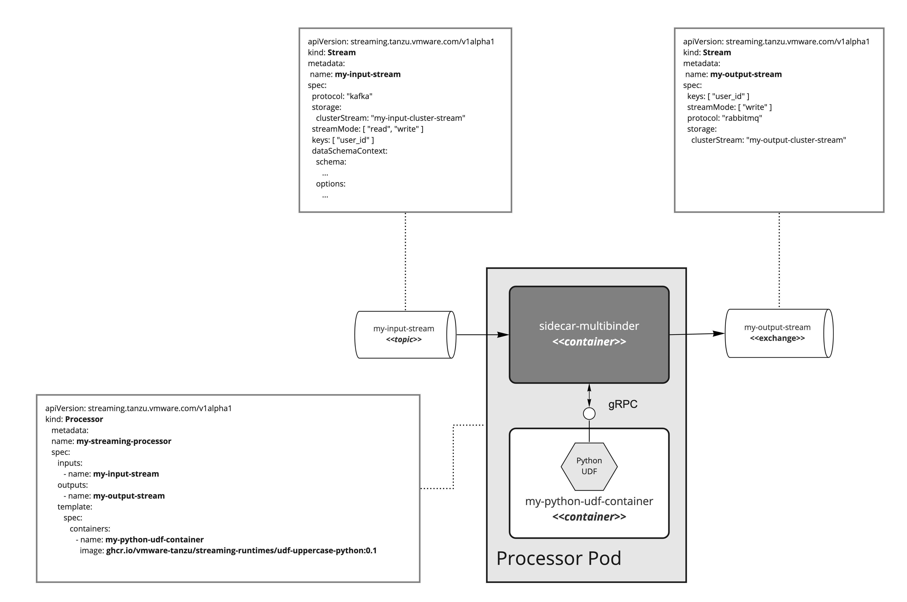

# Streaming Runtimes

## Overview

Kubernetes' execution environment, designed to simplify the development and the operation of streaming data processing applications.
It enables complex data processing scenarios including Time Windowing Aggregation, streaming joins as well as user-defined functions to process the streamed data.

## Try it out

### Prerequisites

Provide access to Kubernetes cluster. 
You can also run it locally within a [minikube](https://kubernetes.io/docs/tasks/tools/#installation).
Make sure to provision enough memory (8G+) and CPU (8CP+) resources:    
```shell
minikube start --memory=8196 --cpus 8
```
For MaOS we recommend using the `hyperkit` driver:
```shell
minikube start --driver=hyperkit --memory=8196 --cpus 8
```
### Run

Install the `Streaming Runtime` operator:
```shell
kubectl apply -f 'https://raw.githubusercontent.com/vmware-tanzu/streaming-runtimes/main/streaming-runtime-operator/install.yaml' -n streaming-runtime
```

Later installs the `streaming-runtime` operator along with the [custom resource definitions (CRDs)](./streaming-runtime-operator/crds) (such as `ClusterStream`, `Stream` and `Processor`) and required roles and binding configurations. 

With this you are set to deploy your streaming pipelines. 
For example you can deploy to [anomaly-detection](./streaming-runtime-samples/anomaly-detection) sample use-case like this:

```shell
kubectl apply -f 'https://raw.githubusercontent.com/vmware-tanzu/streaming-runtimes/main/streaming-runtime-samples/anomaly-detection/streaming-pipeline.yaml' -n streaming-runtime
```
and generate random data for it:
```shell
kubectl apply -f 'https://raw.githubusercontent.com/vmware-tanzu/streaming-runtimes/main/streaming-runtime-samples/anomaly-detection/data-generator.yaml' -n default
```

You can find more examples in [streaming-runtime-samples](./streaming-runtime-samples).

In general the streaming data pipeline implementation would like this:


Your streaming data pipeline is implementing by defining `Stream` and `Processor` custom resources along with custom user defined functions (UDF) implemented in you language of choice. 

The `Stream` input and output resources are used to model the access to your messaging infrastructure (aka Kafka, Pulsar or RabbitMQ), the messaging streams (like topics or exchanges) as well as the schema of the data that flows through those Streams. 
The `Processor` CRD defines how the input should be processed in order to produce the output streams.
You can (optionally) provide Streaming (SQL) Queries that can aggregate, join , re-arrange or just cleanse the input streams before later are passed to the multibinder and your UDF implementations.

If you decide not to use streaming query then the entire architecture might look like this:

E.g. you only define the input and output `Stream`s and the `Processor` to wire them with your custom UDF implementation. 
Check the [user-defined-functions](./user-defined-functions) to learn how to build UDFs. 

NOTE: There is an [undergoing work](https://github.com/vmware-tanzu/streaming-runtimes/issues/13) for implementing a very basic `Time Windowed Aggregation` 
that would allow the developers to calculate aggregates in near-real time directly in their UDFs. 
This feature would provide an alternative (simple) way to build analytics in addition to elaborate Streaming SQL features explained above. 

Finally, you can chain multiple Streams and Processors (e.g. the output `Stream` of one `Processor` is used an input of another) to build  streaming data pipeline.    


### Build & Run

* Streaming Runtime Operator - follow the [Streaming Runtime Operator](./streaming-runtime-operator#build) build instructions to build the operator, create a container image and upload it to container registry.
* User Defined Functions - follow the [User Defined Function](./user-defined-functions) about information how implement and build your own UDF and how to use it from within a Processor resource. 

## Documentation

Visit the official site of the [Streaming Runtimes](https://vmware-tanzu.github.io/streaming-runtimes/) for documentation.

### Build it locally

We use the [docs](./docs/) folder to generate documentation website for this project.

You can build the documentation container image and run it with:

```bash
make docs.build docs.serve
```

This will serve in `localhost:8000` the docs site.

## Samples

The [Streaming Runtime Samples](./streaming-runtime-samples) offers a good starting point to start learning how to build streaming pipeline and what are the components involved.

## Contributing

The streaming-runtimes project team welcomes contributions from the community. All contributors to this project must have a signed Contributor License Agreement (“CLA”) on file with us. The CLA grants us the permissions we need to use and redistribute your contributions as part of the project; you or your employer retain the copyright to your contribution. Before a PR can pass all required checks, our CLA action will prompt you to accept the agreement. Head over to https://cla.vmware.com/ to see your current agreement(s) on file or to sign a new one.
 
For more detailed information, refer to [CONTRIBUTING.md](CONTRIBUTING.md).

