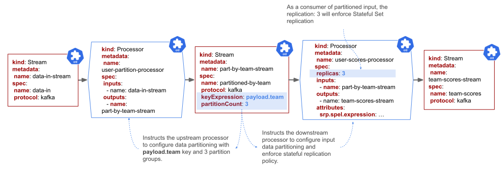
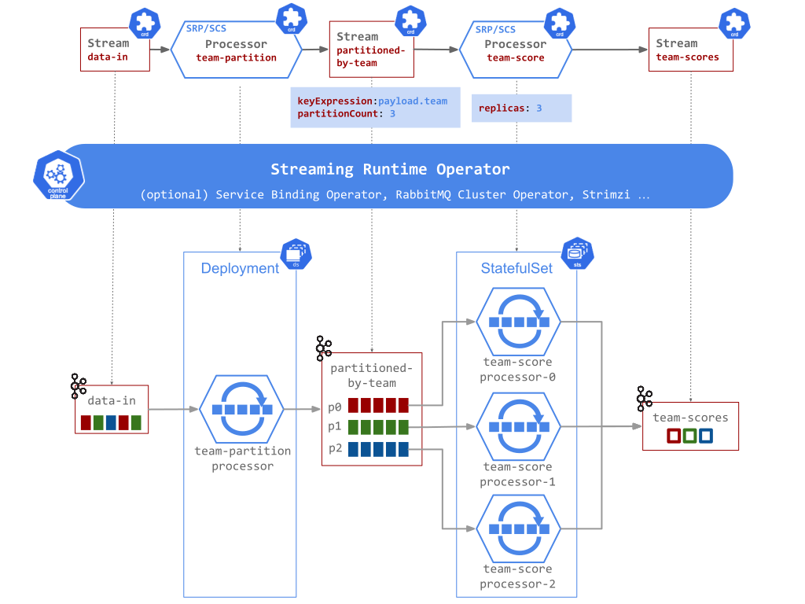

# Data Partitioning

!!! info
    Applicable for the [SRP](../processors/srp/overview.md) and [SCS](../processors/scs/overview.md) processor types. 
    The [FSQL](../processors/fsql/overview.md) processors use the Apache Flink built-in data partitioning capabilities.

Partitioning is an essential concept in stateful data processing. 
It permits consistent data scaling by ensuring that all related data is processed together. Logically it implements the `group by key` processing. 
For example, in a time-windowed average calculation example, all measurements from any given sensor are processed by the same Processor instance. 

Technically, the partitioning allows content-based routing of payloads to the downstream processor instances. 
This is especially useful when you want to have your downstream processor instances to process data from specific partitions from the upstream processor. 
For instance, if a processor application in the data pipeline is performing operations based on a unique identifier from the payload (such as team name), the stream can be partitioned based on that unique identity.

Some messaging middleware (such as Apache Kafka) provide additional guarantees that the data in the partitions remains ordered!

The Streaming Runtime provides a simple construct to enable and configure stateful data partitioning. On the Steam resource that represents the partitioned connection, use the `spec.key` or `spec.keyExpression` to define the what header or payload field to use as a discriminator to partition the data in the steam. 
Additionally use the `spec.partitionCount` property to configure the number of partitions you would like the incoming data to be partitioned into. 
Those properties are used to instruct the upstream processor(s) to provision the data partitioning configuration while the downstream processors are configured for partitioned inputs (e.g. enforce instance ordering and stateful connections). 

If the downstream processor is scaled out (e.g. `replications: N`), then the streaming runtime will ensure [StatefulSet](https://kubernetes.io/docs/concepts/workloads/controllers/statefulset/) replication instead of `Deployment/ReplicationSet`.
Additionally, for the processors consuming partitioned Stream, the SR configures Pod's [Ordinal Index](https://kubernetes.io/docs/concepts/workloads/controllers/statefulset/#ordinal-index) to be used as partition instance-index. 
Later ensures that event after Pod failure/restart the same partitions will be (re)assigned to it.

For example let’s consider an online-game statistics use case where we want to partition the user data by the team field. Using the SR constructs we can define pipeline like this:

The input (data-in) contains user gaming statistics such as score, and team the user is a member of. 
This data is fed into the user-partition Processor and in turn sent downstream via the partition-by-team Steam configured to partition the data by team name into 3 partition groups. 
The downstream (user-score-processor) consumes the partitioned input and because it deploys 3 stateful instances we could expect that each partition will be assigned to a single processor instance.

Learn how to build [partitioned time-window aggregations](../processors/srp/time-window-aggregation.md#partitioned-time-window-aggregation) with the SRP processor.

Also visit the following example to learn how to define and configure partitioned streaming pipelines:

- [Partition by Field with Stateful Replication](../../samples/tutorials.md#5-partition-by-field-with-stateful-replication)
- [Partition by Field using Header Keys](../../samples/tutorials.md#51-partition-by-field-using-header-keys)
- [Partition by Field with replicated Time-Window aggregation](../../samples/tutorials.md#61-partition-by-field-with-replicated-time-window-aggregation)
- [Online Gaming Statistics](../../samples/online-gaming-statistics/online-gaming-statistics.md)