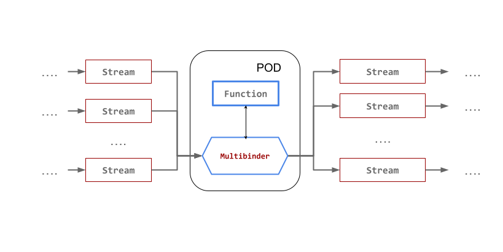

# User Defined **Functions**

The Streaming Runtime provides a way for users to specify a function as a processor with basic Time Windowed Aggregation capabilities. The runtime deploys the function with a sidecar called [multibinder](#the-multibinder) that acts as the connection between the streams and the function deployed. The sidecar exposes an interface with a [protocol](#the-protocol) you can follow in order to build your functions.

## Resource Definition

```yaml
apiVersion: streaming.tanzu.vmware.com/v1alpha1
kind: Processor
metadata: {}
spec:
  # Type of the processor. In this case functions use Time window aggregation (TWA)
  type: TWA
  # Name of the input stream to get data from
  inputs:
    - name: <string>
  # Name of the output stream to send data to
  outputs:
    - name: <string>
  template:
    spec:
      containers:
        # Container with the processing function image
        - name: <string>
          image: <repository-uri>
          # Environment variables used at runtime
          env:
            - name: <string>
              value: <any>
```

## The Multibinder

The Streaming Runtime Operator deploys a side-container next to the processor container that handles connections between the input streams and the output streams.

This sidecar called the `multibinder` exposes an interface to the processor container with an API to process incoming events from the streams and API to receive the data once it's processed by the function.



## The Protocol

The contract of the function specifies a `GrpcMessage` schema to model the messages exchanged between the multibinder and the function. It also defines a `MessagingService` offering four interaction modes to choose from.

```protobuf
syntax = "proto3";

message GrpcMessage {
  bytes payload = 1;
  map<string, string> headers = 2;
}

service MessagingService {
  rpc biStream(stream GrpcMessage) returns (stream GrpcMessage);

  rpc clientStream(stream GrpcMessage) returns (GrpcMessage);

  rpc serverStream(GrpcMessage) returns (stream GrpcMessage);

  rpc requestReply(GrpcMessage) returns (GrpcMessage);
}
```

The [MessageService.proto](https://github.com/vmware-tanzu/streaming-runtimes/blob/main/user-defined-functions/MessageService.proto) allows you to generate required stubs to support the true polyglot nature of gRPC while interacting with functions hosted by `Streaming Runtime`.

The Multibinder forwards the incoming messages over the `MessagingService` to the pre-configured function.
The function response in turn is sent to the Multibinder's output stream.
If the `Time Windowing Aggregation` is enabled, the multibinder will collect all messages part of the window and pass them at once to the function to compute aggregated state.

### Interaction RPC Modes

The `MessagingService` gRPC provides 4 interaction modes:

* Reques/Repply RPC
* Server-side streaming RPC
* Client-side streaming RPC
* Bi-directional streaming RPC

#### Request Reply RPC

The most straightforward interaction mode is Request/Reply. Suppose you have a function in

Java:
```java
public Function<String, String> uppercase() {
    return v -> v.toUpperCase();
}
```

Python:
```python
def requestReply(self, request, context):
    print("Server received Payload: %s and Headers: %s" % (request.payload.decode(), request.headers))
    return MessageService_pb2.GrpcMessage(
        payload=str.encode(request.payload.decode().upper()), headers=request.headers)
```

Or GoLang:
```go
func (s *server) RequestReply(ctx context.Context, in *pb.GrpcMessage) (*pb.GrpcMessage, error) {
    log.Printf("Received: %v", string(in.Payload))
    upperCasePayload := strings.ToUpper(string(in.Payload))
    return &pb.GrpcMessage{Payload: []byte(upperCasePayload)}, nil
}
```

#### Server-side streaming RPC

WIP

#### Client-side streaming RPC

WIP

#### Bi-Directional streaming RPC

WIP

### Notes

- If you are building your `Function` in Java you can find more information about the Spring Cloud Function gRPC support [here](https://github.com/spring-cloud/spring-cloud-function/blob/v3.2.1/spring-cloud-function-adapters/spring-cloud-function-grpc/README.md).
