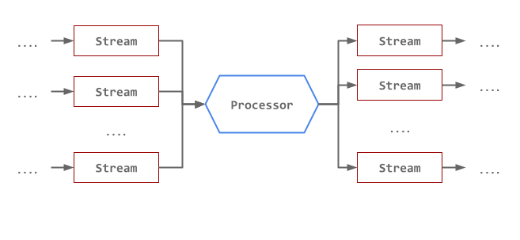

# Processors

Processors represent user code running a transformation on a set of input Streams to a set of output Streams.

The Processor defines how the input(s) should be processed in order to produce the output streams. Depending on the use cases and the type of the processor, multiple input and output streams are supported.

## Processor types

- [FSQL](fsql/overview.md): Backed by Apache Flink SQL Streaming. Allow inline Query definition.
- [Functions](functions/overview.md): User Defined Function. Allow for custom functions in the language of choice to be used as processors.
- [SCS](scs/overview.md): Runs Spring Cloud Stream applications as processors in the pipeline.
