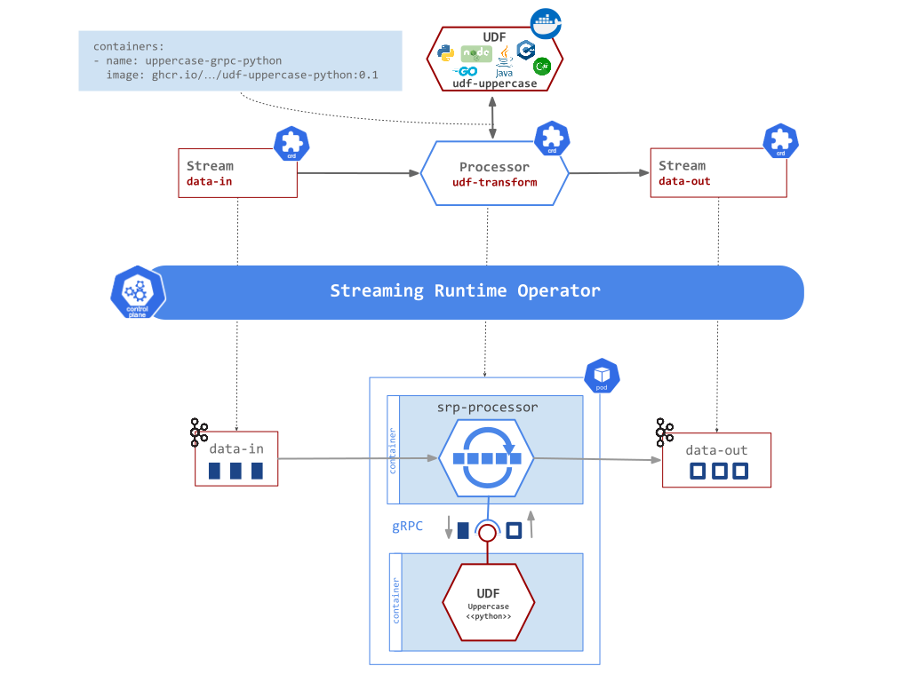
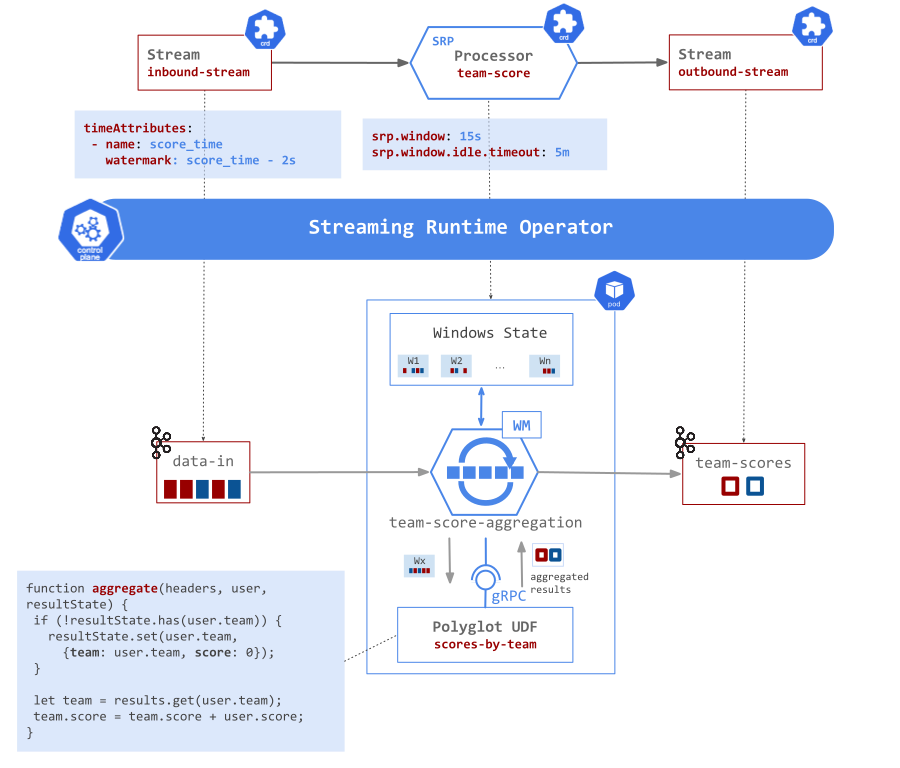

# Streaming Runtime Processor (SRP)

The SRP processor is built-in the Streaming Runtime, provide common capabilities such as message brokerage, [inline streaming transformations](#inline-transformations), [polyglot user-defined functions](./udf/overview.md), simple [tumbling time-window aggregation](./time-window-aggregation.md) and [data-partitioning capabilities](../data-partitioning.md) to name a few.

## Message Transformation Options

The SRP offers 4 ways to implement event transformation logic:

#### Message Broker Bridge

If no inline transformation or UDF functions are configured, the SRP processor simply retransmits the inbound events, unchanged, to the outbound Streams. This could be useful to implement [Message Broker Bridges](https://github.com/vmware-tanzu/streaming-runtimes/blob/main/streaming-runtime-samples/tutorials/2-multibiner-bridge.yaml).

#### Inline Transformations

The `srp.spel.expression` attribute allows setting an inline, [SpEL expressions](https://docs.spring.io/spring-framework/docs/current/reference/html/core.html#expressions) as a transformation function. SpEL is a powerful expression language that supports querying and manipulating an messages at runtime. As Message format has two parts (`headers` and `payload`) that allow SpEL expressions such as `payload`, `payload.thing`, `headers['my.header']`, and so on.
The [inline-transformation](https://github.com/vmware-tanzu/streaming-runtimes/blob/main/streaming-runtime-samples/tutorials/3-inline-transformation.yaml) example shows how to apply `JsonPath` expressions to transform the inbound JSON payload.

#### Header Enrichment

The `srp.output.headers` attribute allows enriching the outbound message headers with values computed form the inbound message header or payload. For example the  `srp.output.headers: "user=payload.fullName"` expression would add a new outbound header named `user` with value computed from the inbound payload field `fullName`. Expression support any structured payload data formats such as Json, AVRO and so on.

#### User Defined Functions (Polyglot)

Polyglot [User Defined Function (UDF)](./udf/overview.md). The Streaming Runtime allows implementing the message transformation logic in the language of your choice, packaged in a standalone image container and deployed as a sidecard in the same Pod along with the SRP Processor.

The communication between the SRP Processor and the UDF running in the sidecar is over gRPC and uses a well defined Protobuf Message Service interface:

## Time-Window Aggregation Capability

For simple workloads the SRP Processor offers lighter, configurable [tumbling time-window capabilities](./time-window-aggregation.md) with in-memory or local state persistence. 
A tumbling time-window assigns each message to a window of a specified time interval. Tumbling windows have a fixed size and do not overlap. 
Find detailed description of SRP [Time-Window capabilities](./time-window-aggregation.md).

## Streaming Data Partitioning

Common [Streaming Data Partitioning Support](../data-partitioning.md) for SRP and SCS Processor types.

