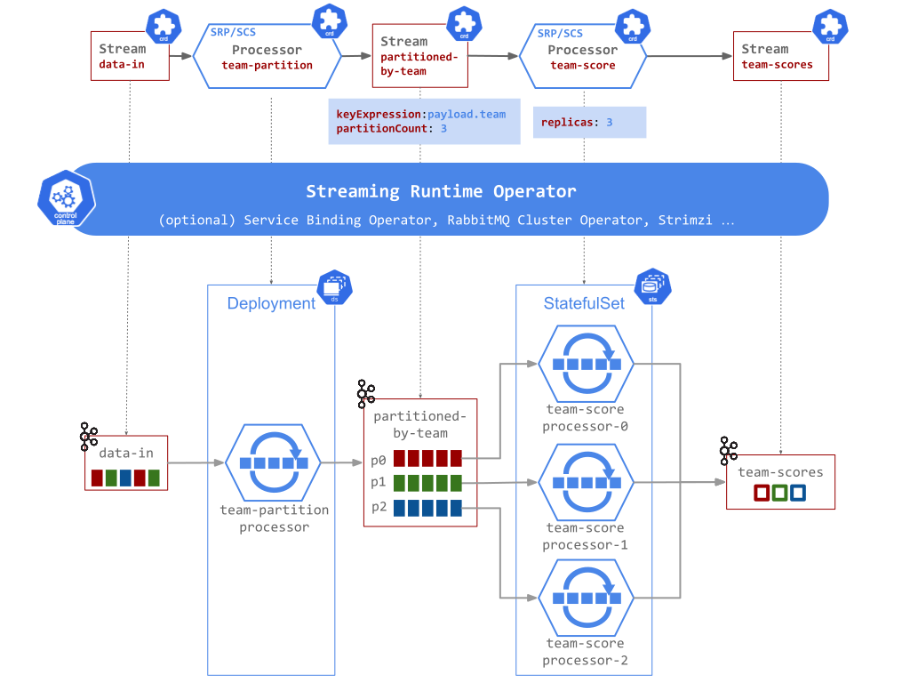

# Streaming Runtime Processor (SRP)

The SRP processor provides generic streaming data processing capabilities such as message brokerage, [inline streaming transformations](#inline-transformations), [polyglot user-defined functions](./udf-overview.md), simple [tumbling time-window aggregation](./time-window-aggregation.md) and [data-partitioning capabilities](../../data-partitioning/data-partitioning.md) to name a few.

It uses [Processor CRD](https://github.com/vmware-tanzu/streaming-runtimes/blob/main/streaming-runtime-operator/crds/processor-crd.yaml) based custom resources to configure the processor within the SR Control Plane. 

The [srp-processor](https://github.com/vmware-tanzu/streaming-runtimes/tree/main/srp-processor) event-driven application implements the Data Plane SRP capabilities.

## SRP Attributes

Few specific attributes that start with the `srp.` prefix are used to configure the SRP specific capabilities.

| SRP Attribute | Description                          |
| ----------- | ------------------------------------ |
| `srp.envs:` | Adds random environment variable to the SRP container configuration. Example: `"TEST_BAR=FOO;TEST_FOO=BAR"` |
| `srp.output.headers` | Adds headers to the output messages. Uses expression like: `"user=header.fullName;team=payload.teamName"` |
| `srp.window`    | Defines the Time-Window aggregation interval. Examples: `5s`, `2m`, `1h` |
| `srp.window.idle.timeout`    | Defines an interval of inactivity to release the idle windows. Should be larger than the window interval! Example: `2m` |
| `srp.input.timestampExpression`    | JsonPath expression Example: `header.eventtime`, or `payload.score_time`. Note: It is advised to use the inbound Stream's timeAttributes instead. |
| `srp.maxOutOfOrderness`    | Supported out of orderness time. Example: `2s`. Note: It is advised to use the inbound Stream's timeAttributes instead. |
| `srp.allowedLateness`    | Max time to allow late events. (Example `1h`). |
| `srp.lateEventMode`    | Defines the policy to deal with late event records. Supports: `DROP`, `UPSERT`, `SIDE_CHANNEL` modes (defaults to `DROP`). |
| `srp.input.schemaRegistryUri`    | configure the Schema Registry uri. Required for `Avro` content types. |
| `srp.skipUdf`    | Forcefully disables the the UDF call. Defaults to false. Note that if you don't provide side-car container this would effectively skip the UDF. |
| `forceStatefulSet` | If replication is larger than 1 and the forceStatefulSet is set to true then the SR will deploy the processor as `StatefulSet` event if there is no partitioned input. Defaults to `false'. (applicable for SRP and CSC processors) |
| `srp.spel.expression` | set an inline, `SpEL` expressions as a data transformation function.  |

Following snippets shows a sample SRP configuration. It uses the `srp.` attributes to configure [tumbling time-window](./time-window-aggregation.md) aggregation interval of 5 seconds, with idle timeout of 60 secs. The late events will be send to dedicated side channel.
Also an [aggregation UDF](./udf-overview.md) is registered to aggregate the temporal aggregates.

```yaml
apiVersion: streaming.tanzu.vmware.com/v1alpha1
kind: Processor
metadata:
  name: user-scores-processor
spec:
  type: SRP
  inputs:
    - name: data-in-stream
  outputs:
    - name: user-scores-stream
  attributes:
    srp.window: 5s # Tumbling Time Window of 5 seconds.
    srp.window.idle.timeout: 60s # Allow partial release of idle time-windows.
    srp.lateEventMode: SIDE_CHANNEL # Send late events a side-channel stream. By default late events are discarded.
  template:
    spec:
      containers:
        - name: scores-by-user-javascript
          # The UDF implementation
          image: ghcr.io/vmware-tanzu/streaming-runtimes/user-score-js:latest
```

## Message Transformation Options

The SRP offers 4 ways to implement event transformation logic:

#### Message Broker Bridge

If no inline transformation or UDF functions are configured, the SRP processor simply retransmits the inbound events, unchanged, to the outbound Streams. This could be useful to implement [Message Broker Bridges](https://github.com/vmware-tanzu/streaming-runtimes/blob/main/streaming-runtime-samples/tutorials/2-multibiner-bridge.yaml).


#### Inline Transformations

The `srp.spel.expression` attribute allows setting an inline, [SpEL expressions](https://docs.spring.io/spring-framework/docs/current/reference/html/core.html#expressions) as a transformation function. SpEL is a powerful expression language that supports querying and manipulating an messages at runtime. As Message format has two parts (`headers` and `payload`) that allow SpEL expressions such as `payload`, `payload.thing`, `headers['my.header']`, and so on.
The [inline-transformation](https://github.com/vmware-tanzu/streaming-runtimes/blob/main/streaming-runtime-samples/tutorials/3-inline-transformation.yaml) example shows how to apply `JsonPath` expressions to transform the inbound JSON payload.

#### Header Enrichment

The `srp.output.headers` attribute allows enriching the outbound message headers with values computed form the inbound message header or payload. For example the  `srp.output.headers: "user=payload.fullName"` expression would add a new outbound header named `user` with value computed from the inbound payload field `fullName`. Expression support any structured payload data formats such as Json, AVRO and so on.

#### User Defined Functions (Polyglot)

Polyglot [User Defined Function (UDF)](./udf-overview.md). The Streaming Runtime allows implementing the message transformation logic in the language of your choice, packaged in a standalone image container and deployed as a sidecar in the same Pod along with the SRP Processor.


The communication between the SRP Processor and the UDF running in the sidecar is over gRPC and uses a well defined ProtocolBuffer Message Service interface:

## Time-Window Aggregation Capability

For simple workloads the SRP Processor offers lighter, configurable [tumbling time-window capabilities](./time-window-aggregation.md) with in-memory or local state persistence. 
A tumbling time-window assigns each message to a window of a specified time interval. Tumbling windows have a fixed size and do not overlap. 
Find detailed description of SRP [Time-Window capabilities](./time-window-aggregation.md).


## Streaming Data Partitioning

Common [Streaming Data Partitioning Support](../../data-partitioning/data-partitioning.md) for SRP and SCS Processor types.

