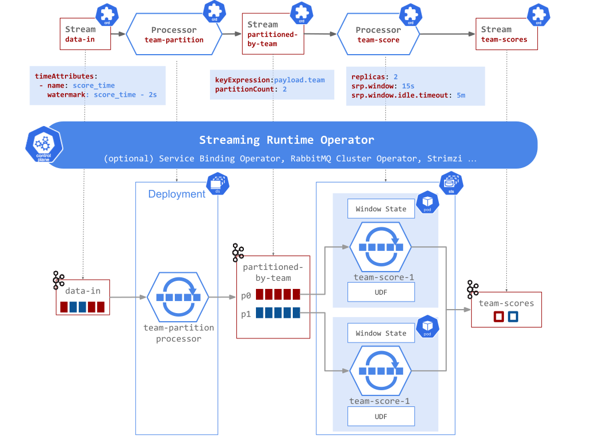

Some data transformations, such as group-by-key, aggregate multiple messages by a common key. For bounded (e.g. batch) datasets, those operations group all of the messages with the same key within the entire data set. But it is impossible in unbounded datasets (e.g. streaming), where new records are being ingested infinitely. 
Consequently, such types of data workloads are commonly processed in windows. Any unbounded dataset can be divided into logical windows. Each message received from the ubound datasets is assigned to one or more windows according to some windowing function, ensuring that each individual window contains a finite number of messages. Grouping transformations then can be applied on each message on a per-window basis. For example group-by-key groups the records within a time-window.

The Streaming Runtime offers two approaches for data windowing. For demanding, complex data processing, you should consider applying the [FSQL Processor](../fsql/overview.md) type, which provides integration with the powerful [Apache Flink Streaming SQL](https://nightlies.apache.org/flink/flink-docs-release-1.15/docs/dev/datastream/operators/windows/). The [FSQL samples](../fsql/overview.md#examples) demonstrate how to leverage this approach. 

For simple workload the [SRP Processor](../srp/overview.md) offers lighter, configurable `tumbling time-window` capabilities with in-memory or local state persistence. 
A tumbling time-window assigns each message to a window of a specified time interval. Tumbling windows have a fixed size and do not overlap. For example, if you specify a tumbling window with a size of 5 minutes.

This feature is useful for workloads where you need to calculate aggregates continuously. For example, for a retailer streaming order information from different remote stores, it can generate near real-time sales statistics for downstream processing. 

The SRP Processor’s time-window aggregates functionality is commonly used in combination with [Aggregate UDFs](./udf-overview.md#aggregation-udf) that operate on the aggregated window data. 
When enabled the tumbling window functionality groups the inbound messages in windowed aggregates and sends later to the configured, Aggregation UDF. The UDF function returns a value or multiple values that are sent downstream for further processing.

To enable the tumbling window, you need to set the `window duration` with the SRP Processor `srp.window attribute`. This instructs the processor to collect the inbound messages into time-window groups based on a `event-time` computed for every message. The inbound Stream’s `spec.timeAttributes` defines how the message event-time is computed and via the watermark expression, how to generate the input watermarks.

!!! info "Even-Time vs Processing Time"
    When processing data which relate to events in time, there are two inherent domains of time to consider: (1) Event Time, which is the time at which the event itself actually occurred and (2) Processing Time, which is the time at which an event is observed at any given point during processing within the pipeline, i.e. the current time according to the system clock.
    Event time for a given event essentially never changes, but processing time changes constantly for each event as it flows through the pipeline and time marches ever forward. This is an important distinction when it comes to robustly analysing events in the context of when they occurred.

The Streaming Runtime can compute event-times from the inbound message body or metadata (e.g. Kafka timestamp header) and defaults to processing time if no time attributes are specified.

The `Watermarks`, implemented by the `SRP Processor`, is an essential tool for reasoning about temporal completeness in infinite streams. It provides a practical way to estimate when a time-window aggregate should have received all its messages and can be sent to the UDF.
In essence the watermark toolkit helps to propagate consistently the event-time (e.g. the time event occurred in its business domain) as the input events (e.g. messages) get processed through the streaming pipeline (at processing time).

For example, let's construct a simple streaming analytics pipeline for a multi-platform team game, aggregating every 15 seconds, per-team scores. 
Let’s assume that the input data has a format like this: 

```
User <name: string, team: (red or blue), score:int, time_score: timestamp>
```

Then we can configure the SR pipeline to use the `time_score` field as event-time and a watermark to tolerate a few seconds out-of-orderness.  
Then set the processor with `srp.window` interval of `15 seconds` and references to the polyglot `Aggregation UDF` that computes the results from the window aggregates. 
For example we can implement a simple Node.js UDF that groups the `scores` per `team` in every window. 

The `Stream` and `Processor` definitions for this example might look like this:


You can find here the actual time-window aggregation example data-pipeline: [6-time-window-aggregation.yaml](https://github.com/vmware-tanzu/streaming-runtimes/blob/main/streaming-runtime-samples/tutorials/6-time-window-aggregation.yaml)

Without getting into details about how the watermarks work internally, here is an approximation how the inbound messages are grouped in time-window aggregates, which after processed by the UDF produces new outbound messages sent downstream:


When deployed the pipeline would look like this:


## Partitioned Time-window Aggregation

The time-window aggregation collects, locally, temporal groups of messages (e.g. windows) that could put pressure on Pod’s memory. Also the aggregation tasks are often CPU demanding and can become a performance bottleneck. To alleviate those problems we can use the processor replications property to spin multiple Processor instances that do the aggregation in parallel. Because this is an aggregation Process the SR operator would make sure to run the new instances into stateful (aka [SatefulSet](https://kubernetes.io/docs/concepts/workloads/controllers/statefulset/)) containers.
But just increasing the number of Processor instances would likely lead to incorrect aggregation results. Since the aggregation task performs group-by-key it is critical that the same key for a given time-window interval is always sent to the same Processor instance!

Fortunately [Data Partitioning]() provides this capability! If we partition the inbound Stream on the same key used for grouping we can ensure that the message middleware and Kubernetes  state management will always dispatch the messages with the same keys to the same processor instance.

In short we can reliably scale out the time-window aggregation processors by ensuring inbound data partitioning on the same key! So our scaled out multiplatform-game application will look like this:



Explore related examples:

- [6.1 Partition by Field with replicated Time-Window aggregation](../../../samples/tutorials.md#61-partition-by-field-with-replicated-time-window-aggregation)
- [Online Gaming Statistics](../../../samples/online-gaming-statistics/online-gaming-statistics.md)
