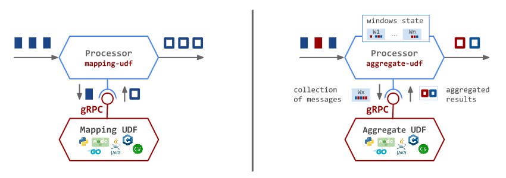
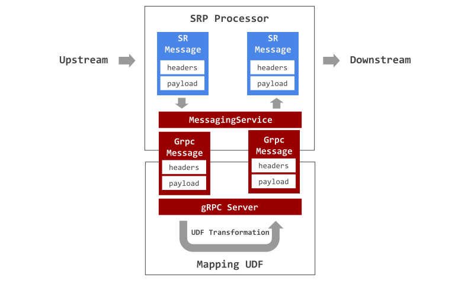
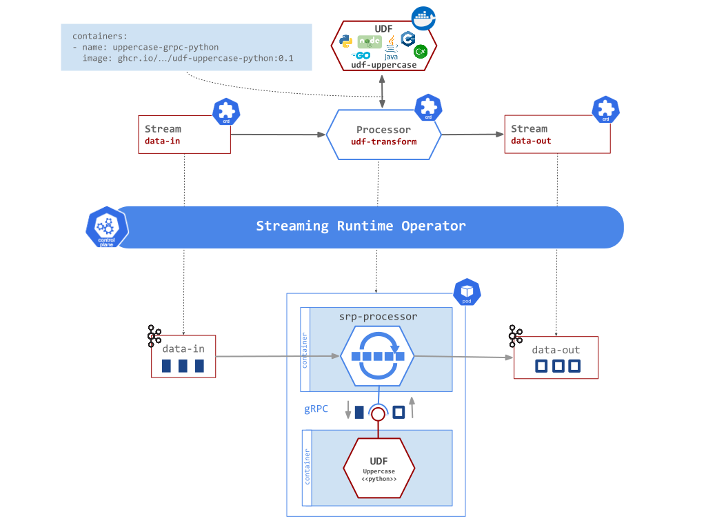
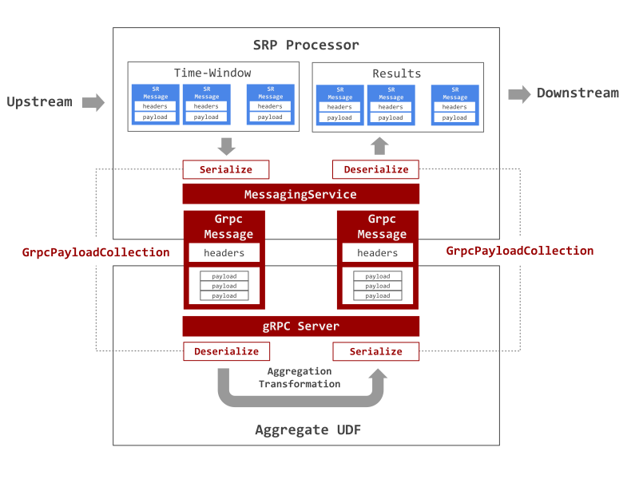

# User Defined **Functions**

The Streaming Runtime provides a pluggable User Defined Functions (UDF) that allows implementing the streaming transformation logic in a language of your choice, test it in isolation with your favorite tools and finally  package it in a standalone container image.

The function is deployed as a sidecar along the [SRP](../overview.md) processor that acts as the connection between the streams and the function deployed. To build your custom function it should adhere to the [UDF Protocol Buffer Contract](#udf-contract) and run as gRPC service.

## Resource Definition

To plug a custom UDF to your SRP Processor, you can refer to UDF’s image from within the Processor resourced definition: 

```yaml linenums="1" hl_lines="6 15 20-21 23-25"
apiVersion: streaming.tanzu.vmware.com/v1alpha1
kind: Processor
metadata: {}
spec:
  # Processor Type: Streaming Runtime Processor (SRP)
  type: SRP
  # Name of the input stream to get data from
  inputs:
    - name: <string>
  # Name of the output stream to send data to
  outputs:
    - name: <string>
  attributes:
   # UDF gRPC connection port
   srp.grpcPort: "50051"
  template:
    spec:
      containers:
        # Container with the UDF function image
        - name: <your-udf-container-name>
          image: <udf-repository-uri>
          # Environment variables applied to the UDF at runtime
          env:
            - name: <string>
              value: <any>
```

## UDF Contract

The contract of the function specifies a `GrpcMessage` schema to model the messages exchanged between the multibinder and the function and the `MessagingService` rpc service to interact with the UDF. 

The `GrpcPayloadCollection` is a temporal workaround to help serialize/deserialize collection on messages, for example the time-window aggregates, 
to and from single byte array. This allow the SRP to sends time-window aggregates to the UDFs using the same `GrpcMessage` format. 

```protobuf
syntax = "proto3";
option java_multiple_files = true;
package org.springframework.cloud.function.grpc;

message GrpcMessage {
  bytes payload = 1;
  map<string, string> headers = 2;
}

message GrpcPayloadCollection {
  repeated bytes payload = 1;
}
 
service MessagingService {
  rpc requestReply(GrpcMessage) returns (GrpcMessage);
}
```

The [MessageService.proto](https://github.com/vmware-tanzu/streaming-runtimes/blob/main/udf-utilities/MessageService.proto) allows you to generate required stubs to support the true polyglot nature of gRPC while interacting with functions hosted by `Streaming Runtime`.

The SRP Processor forwards the incoming messages over the `MessagingService` to the pre-configured UDF function.
The function response in turn is sent to the SRP's output stream.

## UDF Types

Two types of UDF functions are supported: `Mapping UDF` and `Aggregation UDF`


- [Mapping UDF](#mapping-udf) - The SRP forwards the inbound messages, element-wise over the `MessagingService`, to the UDF function. The function computes a result, returns it to the SRP, that in turn sends it downstream. Every inbound message produces a single outbound result!
- [Aggregation UDF](#aggregation-udf) - When the `Time-Window` aggregation is enabled and a window is ready for release, the SRP processor forwards the window content (e.g. collection of messages) to the UDF function. Later processes the collection,  computes one or more aggregation results that are returned to the SRP and sent downstream.

### Mapping UDF

The Mapping UDF function runs a gRPC server with the `MessagingService` implementation. 

As shown in the following diagram, the SRP processor converts every inbound SR message into a `GrpcMessage` and invokes the `requestReply` method on the `MessagingService`. 



The UDF `MessagingService#requestReply` implementation, handles the invocation, computes a result and returns it back as `GrpcMessage`.
The SRP processor converts the `GrpcMessage` result into internal SR Message and sends it downstream over the outbound Streams.

The [3.1-polyglot-udf-transformation.yaml](https://raw.githubusercontent.com/vmware-tanzu/streaming-runtimes/main/streaming-runtime-samples/tutorials/3.1-polyglot-udf-transformation.yaml) example, uses a simple Python mapping UDF to convert the payload to upper case.
Following diagram visualizes how this `polyglot-udf-transformation.yaml` example is deployed by the Streaming Runtime into a running data pipeline:



Processor's `spec.templates.spec.containers` properties are used to register the UDF's image with the SRP processor to use it.

!!! note "Sidecar"
    The Streaming RUntime collocates the UDF container along with the SPR processor container in the same Pod. 
    This simplifies the (gRPC) communication between both containers as they use the 'localhost' network.

Here a few snippets how to implement Mapping UDFs in different languages:

- Java:
```java
public Function<String, String> uppercase() {
    return v -> v.toUpperCase();
}
```
You can find complete source code [udf-uppercase-java](https://github.com/vmware-tanzu/streaming-runtimes/tree/main/streaming-runtime-samples/udf-samples/udf-uppercase-java).
If you are building your `Function` in Java you can find more information about the Spring Cloud Function gRPC support [here](https://github.com/spring-cloud/spring-cloud-function/blob/v3.2.1/spring-cloud-function-adapters/spring-cloud-function-grpc/README.md).

- Python:
```python
def requestReply(self, request, context):
    print("Server received Payload: %s and Headers: %s" % (request.payload.decode(), request.headers))
    return MessageService_pb2.GrpcMessage(
        payload=str.encode(request.payload.decode().upper()), headers=request.headers)
```
You can find complete source code [udf-uppercase-python](https://github.com/vmware-tanzu/streaming-runtimes/tree/main/streaming-runtime-samples/udf-samples/udf-uppercase-python)

- GoLang:
```go
func (s *server) RequestReply(ctx context.Context, in *pb.GrpcMessage) (*pb.GrpcMessage, error) {
    log.Printf("Received: %v", string(in.Payload))
    upperCasePayload := strings.ToUpper(string(in.Payload))
    return &pb.GrpcMessage{Payload: []byte(upperCasePayload)}, nil
}
```
You can find complete source code [udf-uppercase-go](https://github.com/vmware-tanzu/streaming-runtimes/tree/main/streaming-runtime-samples/udf-samples/udf-uppercase-go)


### Aggregation UDF

When the `time-window` aggregation is used the `SRP` processor forwards to the UDF not just a single message but the collection of all messages members of a time-window aggregation. Reversely the UDF may return not just a single result but a collection of results that are treated as separate downstream messages.

The `MessagingService`, used by the `Mapping UDFs`, expects a single `GrpcMessage` as input and single `GrpcMessage` as an output. So if we are to reuse the same gRPC service for `Aggregation UDFs` we need a workaround to allow serializing and deserializing collection of `SR Messages` to and from single `GrpcMessage`. Furthermore we need to do it in interoperable (e.g. language neutral) fashion.  

The `GrpcPayloadCollection` message format is used to ensure interoperability of serialization and deserialization of the payloads for the messages exchanged between the SR Processor and the Aggregation UDF. 
Following diagram illustrates the message flow:



The `SR Message` collections (aka time-window) is converted into a single `GrpcMessage`. 
The headers of the first SR Message in the window is used as headers for the GrpcMessage, including a hardcoded `contentType` header of type `multipart/<inner-message-content-type>`. All SR Message payloads in the window are serialized, with the GrpcPayloadCollection help, into a single byte array used as GrpcMessage payload.

The `Aggregation UDF` is required to deserialize the GrpcMessage payload back into a collection of the original payloads, then apply the aggregation transformation and serialize the collection or results into a single byte array passed as payload in the return GrpcMessage.

Finally the SRP Processor turns the returned GrpcMessage into collection of SR Messages and sends them down streams, one by one.

The [udf-utilities](https://github.com/vmware-tanzu/streaming-runtimes/tree/main/udf-utilities) offers some helpers library that help to hide the gRPC and SerDeser boilerplate code.

!!! Note
    The `GrpcPayloadCollection` serialization/deserialization approach is a hackish workaround to reuse the existing `MessagingService` applicable for non-aggregated messages exchange. 
    A proper, cleaner approach would be to implement a dedicated `AggregatedMessagingService` that takes a collection of `GrpcMessage` messages as input and output.

Check the [Time-Window Aggregation](../time-window-aggregation.md) to see how Aggregation UDFs are being used to compute group-by-key results.