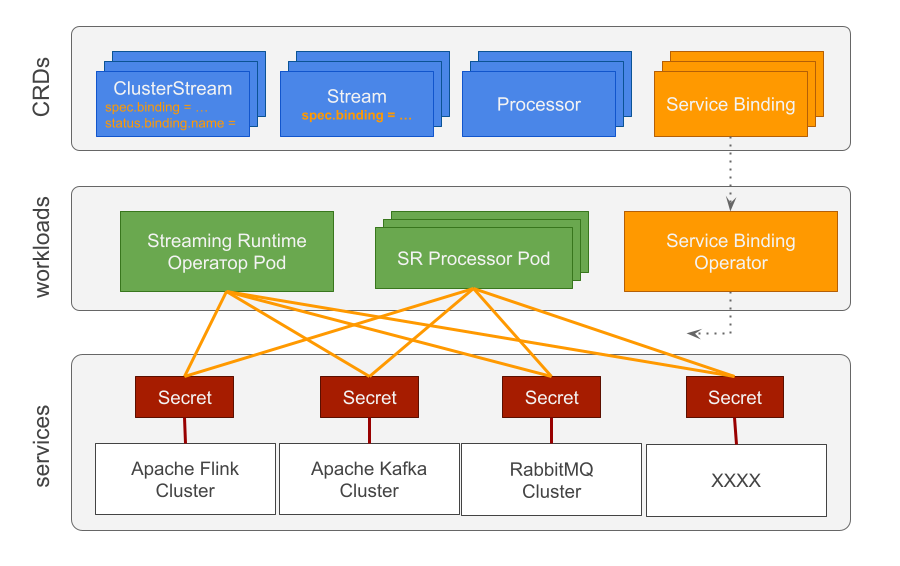

## Overview

To fulfil its tasks, the Streaming Runtime (SR) interacts with external distributed systems such as Apache Kafka, RabbitMQ, Apache Flink and others. 
This implies that SR uses credentials to access those systems. 
Furthermore the SR internally exchanges status information between the managed (`ClusterStream`, `Stream` and `Processor`) resources and part of this information could include sensitive attributes as well.
To avoid configuring and sharing sensitive attributes in plain text the SR needs a mechanism to encapsulate and securely share such attributes amongst its managed resources. 

The [Service Binding Specification for Kubernetes](https://servicebinding.io/) is designed to address this problem by providing a Kubernetes-wide specification for communicating service secrets to workloads in an automated way.



The `ClusterStream` CRD offers a dedicated storage.server.binding attribute that can be used to refer to an existing Service Binding Service (e.g. secrets).

```yaml
apiVersion: streaming.tanzu.vmware.com/v1alpha1
kind: ClusterStream
metadata:
 name: test-clusterstream
spec:
 name: my-exchange
 storage:
   server:
     binding: "my-service-binding-ref"
     url: "http://localhost:8080"
     protocol: "rabbitmq"     
```

The `ClusterStream` reconciler will detect this attribute and converted it into `status.binding.name` in compliance with the [ProvisioningService](https://servicebinding.io/spec/core/1.0.0/#provisioned-service) specification.

```yaml
...
status:
  binding:
    name: "my-service-binding-ref"
...    
```

Later is picked by the `Service Binding Operator`. It lookups and enforces all `ServiceBinding` resources with service name matching the provide binding name. For example

```yaml
apiVersion: servicebinding.io/v1beta1
kind: ServiceBinding
metadata:
 name: streaming-runtime-rabbitmq
spec:
 service:
   apiVersion: v1
   kind: Secret
   name: my-service-binding-ref
 workload:
   apiVersion: apps/v1
   kind: Deployment
   name: streaming-runtime-processor-possible-fraud-processor
```

## Enable Service Binding

* Install the [Service Binding Operator](https://github.com/vmware-tanzu/servicebinding).
Any specification compliant operator can be used but we advice for the VMWare-Tanzu operator:
```bash
kubectl apply -f https://github.com/vmware-tanzu/servicebinding/releases/download/v0.7.1/service-bindings-0.7.1.yaml
```

* Create Kubernetes Secrets for the protected services (e.g. Kafka, RabbitMQ …). 
Note: When operators are used to provision those services, later create the needed secrets automatically. Follow the service operator instructions to find the names of the generated secrets.

```yaml
apiVersion: v1
kind: Secret
metadata:
  name: streaming-runtime-rabbitmq-secret
type: servicebinding.io/rabbitmq
stringData:
  type: rabbitmq
  provider: rabbitmq
  host: rabbitmq.default.svc.cluster.local
  port: "5672"
  # demo credentials
  username: guest
  password: guest
```

* Create `Service Binding` contracts to bind the desired services and workloads.

```yaml
apiVersion: servicebinding.io/v1beta1
kind: ServiceBinding
metadata:
 name: streaming-runtime-rabbitmq
spec:
 service:
   apiVersion: v1
   kind: Secret
   name: streaming-runtime-rabbitmq-secret
 workload:
   apiVersion: apps/v1
   kind: Deployment
   name: streaming-runtime-processor-possible-fraud-processor
 env:
 - name: SPRING_RABBITMQ_PASSWORD
   key: password
 - name: SPRING_RABBITMQ_USERNAME
   key: username
```

* Add binding attribute to `Stream` resource to refer the service secret name

```yaml
apiVersion: streaming.tanzu.vmware.com/v1alpha1
kind: Stream
metadata:
 name: udf-output-possible-fraud-stream
spec:
 name: udf-output-possible-fraud
 keys: [ "card_id" ]
 streamMode: [ "write" ]
 protocol: "rabbitmq"
 # Binding refers to a Secret with the same name. The stream controller uses this binding to configure ClusterStream's auto-creation
 binding: "streaming-runtime-rabbitmq-secret"
 storage:
   clusterStream: "udf-output-possible-fraud-cluster-stream"
```

!!! note "Future Work"
    The Streaming Runtime should be able to create and manage the ServiceBinding objects internally

