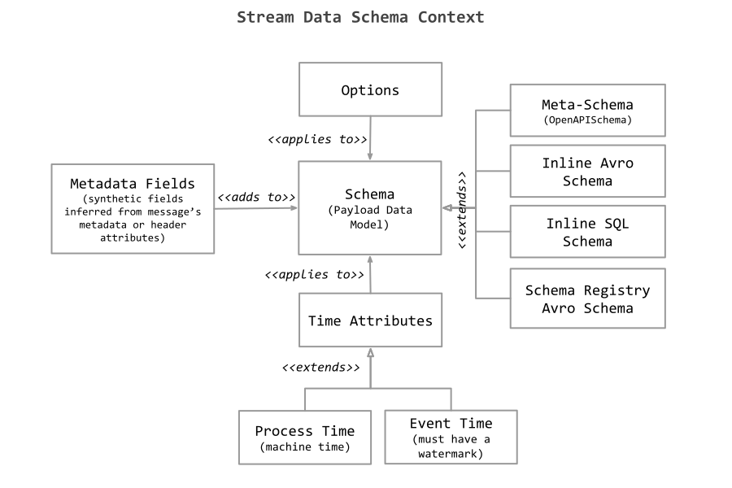
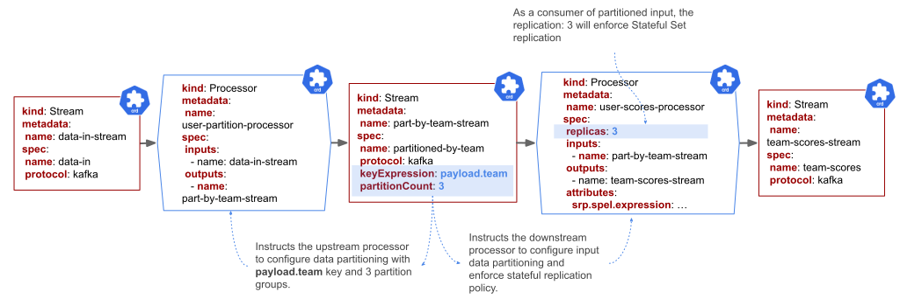

# Streams

The Streams CRD represents storage-at-rest of time-ordered attribute-partitioned data, such as a Kafka topic, or RabbitMQ Stream, exchange/queue.

The `Stream` represents the binder/channel between two or more [Processors](../processors/overview.md).

```yaml
apiVersion: streaming.tanzu.vmware.com/v1alpha1
kind: Stream
metadata: {}
spec:
  # Name of the Stream
  name: <string>
  # (Optional) Data Schema and Time Attributes
  dataSchemaContext:
    inline:
      Schema: <inline-schema>  
    #(or 
    schema: <meta-schema> )
    ...
    timeAttributes:
    - name: ...
      watermark: ...
  # Attributes used as partitioning keys (either keys or keyExpression is allowed)
  keys: [ <string> ]
  # Attributes used as partitioning keys (either keys or keyExpression is allowed)
  keyExpression: [ <string> ]
  # Stream mode that the stream will be used for
  streamMode: [ <string> ]
  # Protocol to be used for the stream e.g. kafka
  protocol: <string>
  storage:
    # Name of the ClusterStream resource
    clusterStream: <string>
```

The namespaced Streams declared (created) by a developer are backed by a [ClusterStream](../cluster-streams/overview.md) resource which is controlled and provisioned by the administrator.

## ClusterStream relation

The `ClusterStreams` and the `Streams` follow the [PersistentVolume](https://kubernetes.io/docs/concepts/storage/persistent-volumes/) model: namespaced `Stream` declared by a developer (ala `PVC`) is backed by a `ClusterStream` resource (ala `PV`) which is controlled and provisioned by the administrator.
For convenience during the development stage, the SR operator auto-provisions the `ClusterStreams` for all `Streams` that don't have explicitly declared them.

## Data Schema

The Stream CRDs can provide an elaborate [Data Schema](./streaming-data-schema.md) to define the structure, time and serialization details of the Stream messages. 
The data schema context comprises a `schema` of the message payload along with additional `time-attributes`, metadata mappings and configuration options. 



## Data Partitioning

For [SRP](../processors/srp/overview.md) and [SCS](../processors/scs/overview.md) processor types the `key` and `keyExpression` attributes are used to configure a [data partitioning](../processors/data-partitioning.md) of the streamed data.



## Data Policies

WIP

## Usage

Streams can be used as either input or output in the stream processing system;


When deployed each Stream resource is represented by a messaging middleware topic/queue/exchange.

Similarly the Processor resources are represented by executable message processing processors that adhere to the Streaming Runtime platform requirements.
