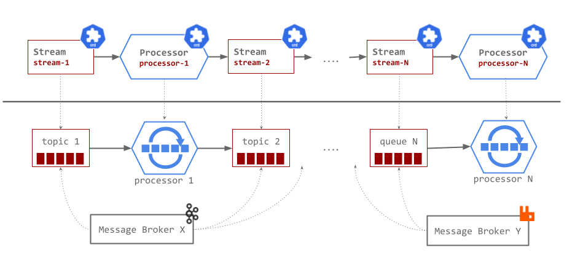

# Streams

The Streams CRD represents storage-at-rest of time-ordered attribute-partitioned data, such as a Kafka topic, or RabbitMQ Stream, exchange/queue.

```yaml
apiVersion: streaming.tanzu.vmware.com/v1alpha1
kind: Stream
metadata: {}
spec:
  # Name of the Stream
  name: <string>
  # Attributes used as primary keys
  keys: [ <string> ]
  # Stream mode that the stream will be used for
  streamMode: [ <string> ]
  # Protocol to be used for the stream e.g. kafka
  protocol: <string>
  storage:
    # Name of the ClusterStream resource
    clusterStream: <string>
```

The namespaced Streams declared (created) by a developer are backed by a [ClusterStream](../cluster-streams/overview.md) resource which is controlled and provisioned by the administrator.

## Usage

Streams can be used as either input or output in the stream processing system;



When deployed each Stream resource is represented by a messaging middleware topic/queue.

Similarly the Processor resources are represented by executable message processing processors that adhere to the Streaming Runtime platform requirements.
