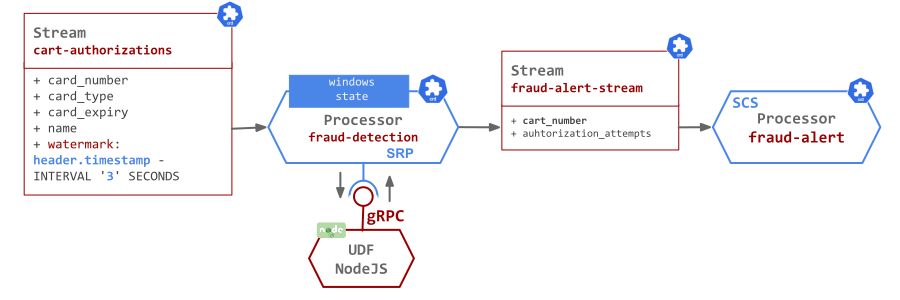

# { align=left, width="35"} Credit Card Anomaly Detection - SRP 

This is the same Use Case as [Anomaly Detection (FSQL)](./anomaly-detection.md) but the time-window aggregation is implemented with the [SRP Processor](../../architecture/processors/srp/overview.md) instead of the [FSQL](../../architecture/processors/fsql/overview.md) one.

Imagine a stream of credit card authorization attempts, representing, for example, people swiping their chip cards into a reader or typing their number into a website. 

Such stream may look something like this:

```json
{"card_number": "1212-1221-1121-1234", "card_type": "discover", "card_expiry": "2013-9-12", "name": "Mr. Chester Stracke" },
{"card_number": "1234-2121-1221-1211", "card_type": "dankort", "card_expiry": "2012-11-12", "name": "Preston Abbott" }
...
```

We would like to identify the suspicious transactions, in real time, and extract them for further investigations. 
For example we can count the incoming authorization attempts per card number and identify those authorizations that occurs suspiciously often.

Lets use the `Streams` and `Processors` streaming-runtime resources to build such abnormal authorization detection application:



The input stream, `card-authorization` , does not provide a time field for the time when the authorization attempt was performed. 
Such field would have been preferred option for the time widowing grouping.
The next best thing is to use the message timestamp assigned by the message broker to each message.
The implementation details section below explain how this is done to provision an additional `event_time` field to the authorization attempts data schema.

The `possible-fraud-detection` CR definition leverages the [Time-Window Aggregation](../../architecture/processors/srp/time-window-aggregation.md) and [User Defined Function](../../architecture/processors/srp/udf-overview.md) capabilities provided by the [SRP Processor](../../architecture/processors/srp/overview.md) type:

```yaml linenums="1" hl_lines="6 12-13 17-18"
apiVersion: streaming.tanzu.vmware.com/v1alpha1
kind: Processor
metadata:
  name: possible-fraud-detection
spec:
  type: SRP
  inputs:
    - name: card-authorizations-stream
  outputs:
    - name: fraud-alert-stream
  attributes:
    srp.window: 5s
    srp.window.idle.timeout: 60s
  template:
    spec:
      containers:
        - name: fraud-detection-udf
          image: ghcr.io/vmware-tanzu/streaming-runtimes/udf-anomaly-detection-js:latest
```

We are only interested in frequent authorization attempts that happen in short intervals of time. 
For this we split the incoming stream into a series of fixed-sized, non-overlapping and contiguous time intervals called `Tumbling Windows` (`12-13`). 
Here we aggregate the stream in intervals of `5 seconds` assuming that `5` authorization attempts in `5` seconds would be hard for a person to do. 
Swiping the card or submitting the form five times within five seconds is a little weird. 

<!-- If we see that happening it is flagged as a possible fraud and inserted to the possible-fraud-stream (`1`). -->

To group the incoming authorization attempts by the card numbers we use an [Aggregation UDF](../../architecture/processors/srp/udf-overview.md#aggregation-udf) function. (registered at lines: `17-18`). 

The `udf-anomaly-detection-js` UDF is implemented in [Node.js](https://nodejs.org/en/about/) - full code is [here](https://github.com/vmware-tanzu/streaming-runtimes/tree/main/streaming-runtime-samples/anomaly-detection/light/fraud-detection-udf-js) and published as container image.

The actual aggregation code looks like this:

```js title="fraud-detector.js" linenums="1"
const udf = require('streaming-runtime-udf-aggregator');

// --------- UDF aggregation function --------
function aggregate(headers, authorization, results) {

    if (!results.has(authorization.card_number)) {

        results.set(authorization.card_number, {
            from: headers.windowStartTime,
            to: headers.windowEndTime,
            card_number: authorization.card_number,
            count: 0,
        });
    }

    // Increment the authorization count for that card_number.
    let authorizationCounter = results.get(authorization.card_number);
    authorizationCounter.count = Number.parseInt(authorizationCounter.count) + 1;
}

// --------- UDF release results function --------
function release(results) {

    let finalResults = new Map();

    // Filter in only the aggregates with more than 5 authorization attempts.    
    results.forEach((authorizationCounter, card_number) => {
        if (authorizationCounter.count > 5) {
            finalResults.set(card_number, authorizationCounter);
        }
    });

    return finalResults;
}

new udf.Aggregator(aggregate, release).start();
```

The `Aggregator` (line `36`) is a helper that starts the gRPC server and listens for next time window aggregate collected and sent from the SRP Processor.
When new aggregate arrives the `Aggregator` calls the `aggregate` function (line `4`) sequentially for every entry in the aggregate. 
The function (lines `4-19`) implements a group-by-card_number count and stores it in the shared `result` object.

When all entries in the window are processed by the `aggregate` function, the `Aggregator` sends the computed results to the `release` function. 
Later filters in only the result counts larger than `5`.  
Finally the filtered results are send back to the SRP processor and each result entry is converted into a separate message send downstream.

Next the `fraud-alert` CSC processor is used to print the fraudulent results. 

## Quick start

- Follow the [Streaming Runtime Install](../../install.md) instructions to instal the operator.

- Install the anomaly detection streaming application:
```shell
kubectl apply -f 'https://raw.githubusercontent.com/vmware-tanzu/streaming-runtimes/main/streaming-runtime-samples/anomaly-detection/light/streaming-pipeline-light.yaml' -n streaming-runtime
```

- Install the authorization attempts random data stream:
```shell
kubectl apply -f 'https://raw.githubusercontent.com/vmware-tanzu/streaming-runtimes/main/streaming-runtime-samples/anomaly-detection/light/data-generator-light.yaml' -n streaming-runtime
```

- Follow the [explore results](../../instructions/#explore-the-results) instructions to see what data is generated and how it is processed though the pipeline. 

- To delete the data pipeline and the data generator:
```shell
kubectl delete srs,srcs,srp --all -n streaming-runtime 
kubectl delete deployments,svc -l app=authorization-attempts-data-generator -n streaming-runtime
```

## Next Step

Visit next use case: [Clickstream Analysis](../clickstream/clickstream.md)