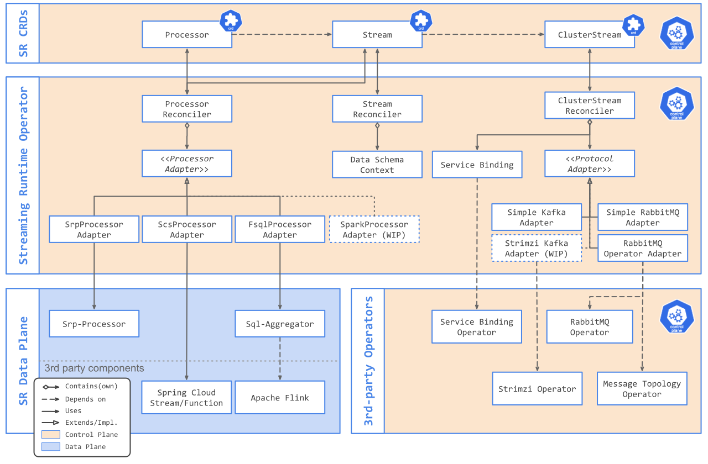

## Streaming-Lite

For applications which rely on time-ordered delivery of events for a single key, but which do not perform any cross-key operations like joins or repartitioning. 
These applications include windowing in some cases but not others. 
Typically, streaming-lite applications run as pipelined workloads in an existing scheduler framework such as TAS or Kubernetes. 
Examples include ETL applications and time-series analysis.

The Streaming Runtime [SRP](./architecture/processors/srp/overview.md) and [SCS](./architecture/processors/scs/overview.md) processor types are provided to support the Streaming Light use case. The built-in, general purpose SRP processor is capable of data partitioning, scaling, time-window aggregation and polyglot UDF functions. The SCS processor provide drop-in support for the large Spring Cloud Stream / Spring Cloud Function ecosystems.

## Streaming-Expert

For applications which perform cross-stream analysis using joins and/or repartitioning, or applications which may perform dynamic stream operations (for example, windowing based on data conditions rather than time or rows). These applications typically using a pool of worker nodes, where the code and data is distributed to nodes using a framework-specific technique. Examples include Apache Spark, Apache Beam, and Apache Flink.

Currently the Streaming Runtime offers a [FSQL](./architecture/processors/fsql/overview.md) processor type that can run fully-fledged Apache Flink Streaming SQL queries. (in embedded mode only).

## Implementation Stack

The Streaming Runtime implementation stack looks like this:

TODO: Provide [CRC documentation](http://agilemodeling.com/artifacts/crcModel.htm) for the implementation stack.