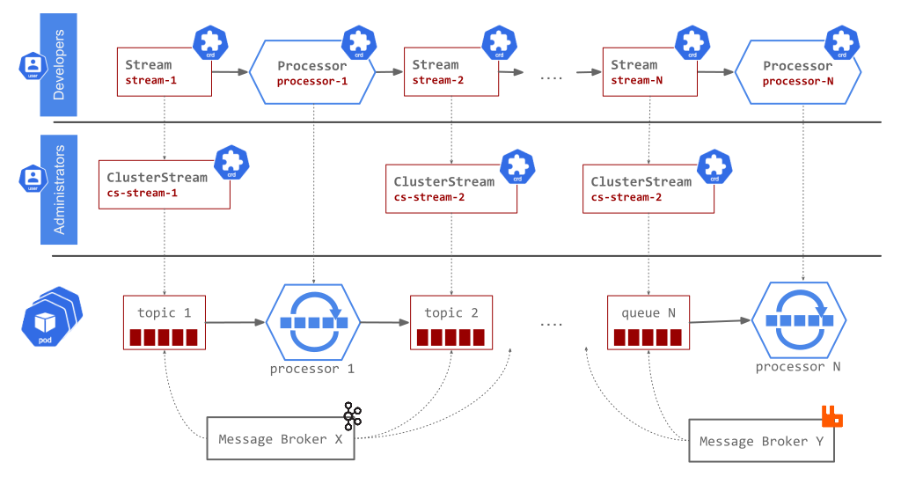

The Streaming Runtime (SR) implements, architecturally, the streaming data processing as a collection of independent event-driven streaming applications, called [Processors](./architecture/processors/overview.md), connected over a messaging middleware of choice (for example RabbitMQ or Apache Kafka). 
The connection between two or more `Processors` is called [Stream](./architecture/streams/overview.md): 


The `Stream` and the `Processor` [^1] are implemented as Kubernetes API extensions, defined as [Custom Resources](https://kubernetes.io/docs/concepts/extend-kubernetes/api-extension/custom-resources/) and providing [Reconciliation Controllers](https://kubernetes.io/docs/concepts/extend-kubernetes/api-extension/custom-resources/#custom-controllers) for them. The [SR technical stack](./sr-technical-stack.md#implementation-stack) offers implementation details.

The `Stream` resource object specifies the access to a messaging infrastructure (aka Apache Kafka, Apache Pulsar or RabbitMQ) plus related metadata such as [data schema](./architecture/streams/streaming-data-schema.md) or [data partitioning](./architecture/data-partitioning/data-partitioning.md). This specification is used by the SR controllers to configure and wire the underlining connections.

The `Processor` instance specifies the event-driven streaming application to be configured and deployed by the SR processor controllers. Once deployed the application continuously receives data from the input streams, transforms it and sends the results downstream over the output streams. 

Every Processor can have zero or more input and output Streams. The collection of `Processors` and `Streams` come together at runtime to constitute streaming `Data Pipelines` (sometimes referred as `Multistage topologies`):

=== "Simplified diagram"
    
=== "Full (with ClusterStream) diagram"
    

The pipelines can be linear or nonlinear, depending on the data flows between the applications.

After [installing](./install.md) the SR operator, one can use the `kind:Stream` and `kind:Processor` resources to define a new streaming application like this:

=== "Development stage"
    For convenience during the development stage, the SR operator auto-provisions the `ClusterStreams` for all `Streams` that don't have explicitly declared them.

    ```yaml title="simple-streaming-app.yaml"
    apiVersion: streaming.tanzu.vmware.com/v1alpha1
    kind: Stream
    metadata:
      name: data-in-stream
    spec:
      name: data-in
      protocol: "kafka"
    ---
    apiVersion: streaming.tanzu.vmware.com/v1alpha1
    kind: Processor
    metadata:
      name: multibinder-processor
    spec:
      type: SRP # use the built-in processor implementation
      inputs:
        - name: data-in-stream
      outputs:
        - name: data-out-stream
    ---
    apiVersion: streaming.tanzu.vmware.com/v1alpha1
    kind: Stream
    metadata:
      name: data-out-stream
    spec:
      name: data-out
      protocol: "rabbitmq"
    ```
=== "Production stage"
    In production environment the Streaming Runtime will not be allowed to auto-provision ClusterStreams dynamically. 
    Instead the Administrator will provision the required messaging middleware and declare ClusterStream to provide managed and controlled access for it.

    The `ClusterStreams` and the `Streams` follow the [PersistentVolume](https://kubernetes.io/docs/concepts/storage/persistent-volumes/) model: namespaced `Stream` declared by a developer (ala `PVC`) is backed by a `ClusterStream` resource (ala `PV`) which is controlled and provisioned by the administrator.

    ```yaml title="simple-streaming-app.yaml"
    #################################################
    #  ADMIN responsibility
    #################################################

    apiVersion: streaming.tanzu.vmware.com/v1alpha1
    kind: ClusterStream
    metadata:
      name: kafka-cluster-stream
    spec:
      name: data-in
      streamModes: ["read", "write"]
      storage:
        server:
          url: "kafka.default.svc.cluster.local:9092"
          protocol: "kafka"
        reclaimPolicy: "Retain"
    ---
    apiVersion: streaming.tanzu.vmware.com/v1alpha1
    kind: ClusterStream
    metadata:
      name: rabbitmq-cluster-stream
    spec:
      name: data-out
      streamModes: ["read", "write"]
      storage:
        server:
          url: "rabbitmq.default.svc.cluster.local:5672"
          protocol: "rabbitmq"
        reclaimPolicy: "Retain"
    ---
    #################################################
    #  DEVELOPER responsibility
    #################################################

    apiVersion: streaming.tanzu.vmware.com/v1alpha1
    kind: Stream
    metadata:
      name: data-in-stream
    spec:
      name: data-in
      protocol: "kafka"
      storage:
        # Claims the pre-provisioned Kafka ClusterStream.
        clusterStream: kafka-cluster-stream 
    ---
    apiVersion: streaming.tanzu.vmware.com/v1alpha1
    kind: Processor
    metadata:
      name: multibinder-processor
    spec:
      type: SRP
      inputs:
        - name: data-in-stream
      outputs:
        - name: data-out-stream
    ---
    apiVersion: streaming.tanzu.vmware.com/v1alpha1
    kind: Stream
    metadata:
      name: data-out-stream
    spec:
      name: data-out
      protocol: "rabbitmq"
      storage:
        # Claims the pre-provisioned rabbitmq ClusterStream.
        clusterStream: rabbitmq-cluster-stream 

    ```

and submit it to a Kubernetes cluster:

```bash
kubectl apply -f ./simple-streaming-app.yaml -n streaming-runtime
```

On submission, the SR controllers react by provisioning and configuring the specified resources.
For example the `SRP` processor type instructs the SR to provision the built-in, general purpose, [SRP processor](./architecture/processors/srp/overview.md) implementation.
Likewise if the messaging middleware declared in Stream's `protocol` (in this case Apache Kafka) is not available, the controller for the [ClusterStream](./architecture/cluster-streams/overview.md) that backs that Stream will detect and provision the required messaging broker.

!!! info ""
    The sample app itself acts as a message bridge. It receives input messages from Apache Kafka, `data-in` topic and re-transmits them, unchanged, to the output RabbitMQ `data-out` exchange.

Developers have different options to build their own data transformation logic and use it with the Streaming Runtime. 
The following processor types provide complimentary extension options that can be used interchangeably:

- [SRP Processor](./architecture/processors/srp/overview.md) - is a general purpose, processor, that allows developers to plug in their own, polyglot [User Defined Functions](./architecture/processors/srp/udf-overview.md) (UDF). The SRP processors provide support for [Tumbling Time-Window](./architecture/processors/srp/time-window-aggregation.md) aggregations and [streaming Data Partitioning](./architecture/data-partitioning/data-partitioning.md).
- [SCS Processor](./architecture/processors/scs/overview.md) - can run any [Spring Cloud Stream](https://spring.io/projects/spring-cloud-stream) application natively in Kubernetes. One can choose from the  extensive set (60+) of [pre-built streaming applications](https://dataflow.spring.io/docs/applications/pre-packaged/#stream-applications) or build a custom one. The SCS Processor supports stateful and stateless workloads and stream [data partitioning](./architecture/data-partitioning/data-partitioning.md)[^2].
- [FSQL Processor](./architecture/processors/fsql/overview.md) - is backed by Apache Flink and supports streaming SQL. 
This allows the developers to implement complex data transformation, such as stream join or windowed aggregation, by defining streaming SQL queries.

## Next Steps

After [installing](./install.md) the streaming runtime, follow the [Samples](./samples/overview.md) for various executable examples.

[^1]: The Streaming Runtime Operator provides also a [ClusterStreams](./architecture/cluster-streams/overview.md) resources, that are responsible to provision the messaging middleware used by the [Streams](./architecture/streams/overview.md). 
The `ClusterStreams` and the `Streams` follow the [PersistentVolume](https://kubernetes.io/docs/concepts/storage/persistent-volumes/) model: namespaced `Stream` declared by a developer (ala `PVC`) is backed by a `ClusterStream` resource (ala `PV`) which is controlled and provisioned by the administrator.
For convenience during the development stage, the SR operator auto-provisions the `ClusterStreams` for all `Streams` that don't have explicitly declared them.

[^2]: The SCS Processor also provides limited support for [polyglot applications](https://dataflow.spring.io/docs/recipes/polyglot/processor/). 
