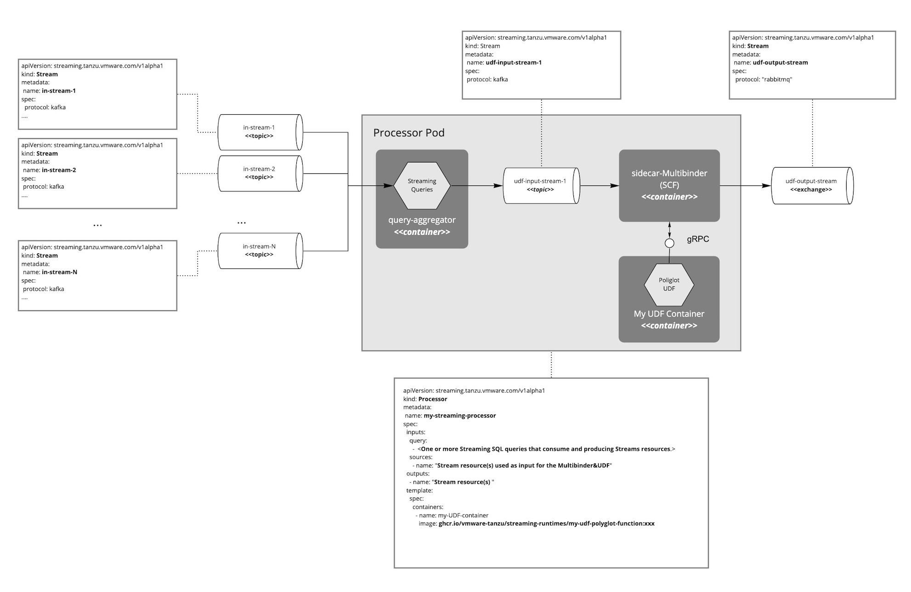

# Streaming pipeline deployment
With this you are set to deploy your streaming pipelines.

For example, you can deploy the [anomaly-detection](../samples/anomaly-detection/anomaly-detection/) sample:

```shell
kubectl apply -f 'https://raw.githubusercontent.com/vmware-tanzu/streaming-runtimes/main/streaming-runtime-samples/anomaly-detection/streaming-pipeline.yaml' -n streaming-runtime
```
and the `data-generator` that simulates the input authorization streams for this use case:
```shell
kubectl apply -f 'https://raw.githubusercontent.com/vmware-tanzu/streaming-runtimes/main/streaming-runtime-samples/anomaly-detection/data-generator.yaml' -n default
```

You can find more examples in Streaming Runtime [Samples](../samples/overview).

In general the streaming data pipeline implementation would like this:



Your streaming data pipeline is implementing by defining `Stream` and `Processor` custom resources along with custom user defined functions (UDF) implemented in you language of choice.

The `Stream` input and output resources are used to model the access to your messaging infrastructure (aka Kafka, Pulsar or RabbitMQ), the messaging streams (like topics or exchanges) as well as the schema of the data that flows through those Streams.
The `Processor` CRD defines how the input should be processed in order ot produce the output streams.
You can (optionally) provide Streaming (SQL) Queries that can aggregate, join , re-arrange or just cleanse the input streams before later are passed to the multibiner and your UDF implementations.

If you decide not to use streaming query then the entire architecture might look like this:

E.g. you only define the input and output `Stream`s and the `Processor` to wire them with your custom UDF implementation.
Check the [user-defined-functions](../udf/architecture/) to learn how to build UDFs.

NOTE: There is an [undergoing work](https://github.com/vmware-tanzu/streaming-runtimes/issues/13) for implementing a very basic `Time Windowed Aggregation`
that would allow the developers to calculate aggregates in near-real time directly in their UDFs.
This feature would provide an alternative (simple) way to build analytics in addition to elaborate Streaming SQL features explained above.

Finally, you can chain multiple Streams and Processors (e.g. the output `Stream` of one `Processor` is used an input of another) to build  streaming data pipeline.

