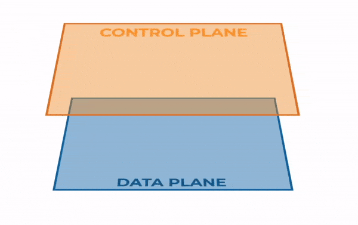
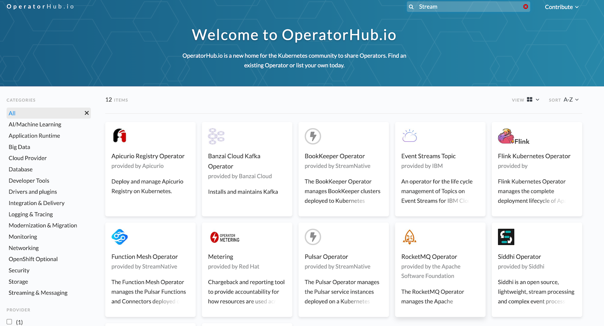
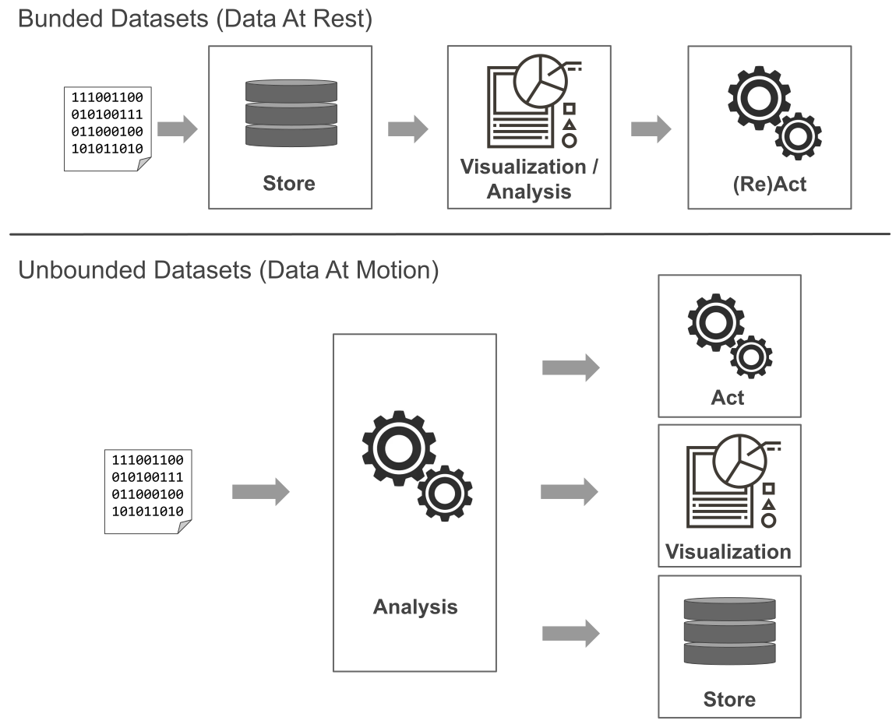

# Why Streaming Runtime?

## Control Plane vs Data Plane

In System Design the `Control Plane` is the (sub)system that __defines__ and __controls__ how the work should be done. 
The `Data Plane` on the other hand is where the actual work is done. 

Such separation of concerts allow innovation and scale of the Data Plane and Control Plane separately from the other plane.

In the context of the `Streaming Runtime` the `Data Plane` is where most of the data transformations happen and is optimized for *speed of processing*, *availability*, *simplicity* and *regularity*. 
{ align="left" width="350" } 
The `Control Plane` controls the `Data Plane` and is optimized for *decision making* and in general facilitating and simplifying the `Data Plane` processing. 

The Control Plane instantiates and tears down `Processors` as needed, provisions and configures the infrastructure backing the `Streams` and `ClusterStream` messaging middleware. 
The Control Plane manages the partitioning, scaling and internal states of the pipeline run in the Data Plane.

Kubernetes itself is designed around the Control Plane and Data Plane principles. 
It is comprised of __independent__ and __composable__ __process controllers__ that __continuously drive__ the __current state__ toward the provided __desired state__. 
Controllers operate on a collection of API objects of a certain kind; for example, the built-in pods resource contains a collection of Pod objects.

Kubernetes is extensible, allowing to add new custom APIs and process controllers. 
This provides us with a framework to build and run distributed applications resiliently! 
The framework provides the building blocks for building developer platforms, but preserves user choice and flexibility where it is important.

Kubernetes takes care of scaling and failover and self-healing for your custom platforms, and provides deployment patterns, such as canary or blue/green deployments. 
Among others it provides:

- Components using the apiserver benefit from common access control, audit logging, and policy extension
- The Kubernetes apiserver maintains its own strongly-consistent storage via etcd, reducing the number of storage backends needed.
- common tools for managing API problems, such as validation and version changes.
- Lastly, using the apiserver to host additional resources allows the resources to be managed with the same tooling as built-in resources.

Another advantage of using Kubernetes as a Framework to build the Streaming Runtime is the the existing rich ecosystem of Kubernetes operators ([https://operatorhub.io](https://operatorhub.io)) : 

For example the `RabbitMQ Operator` or `Strimzi Operator` all provisioning and managing RabbitMQ or Kafka cluster in Kubernetes environments.

## Steaming vs Batch Processing

In Batch processing the processing and analysis happens on a set of data that have already been stored over a period of time. An example is payroll and billing systems that have to be processed weekly or monthly. 

While the Table/Batch processing operates on data-at-rest ( e.g. bounded datasets), the streaming data processing operates on data-at-motion (unbounded datasets). 

The stream processing is defined as the processing of an unbounded amount of data without interaction or interruption. 

Business cases for stream processing include: real-time credit card fraud detection or predictive analytics or near-real-time business data processing for actionable analytics.